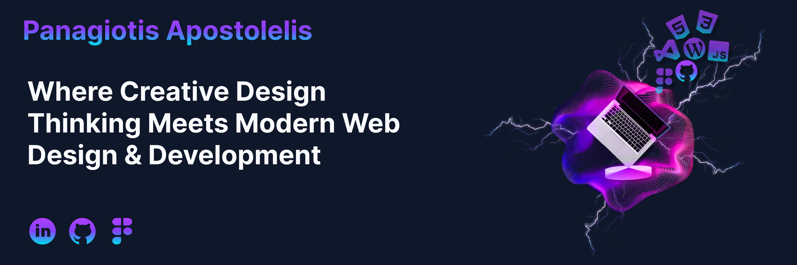

  

 

## 📊 GitHub Stats:
 
 

 

## 💫 About Me:
**UI/UX Designer & Junior Front-end Developer**.  
Εστιάζω στον σχεδιασμό χρηστικών διεπαφών στο Figma και στην υλοποίηση ιστοσελίδων σε WordPress (Breakdance Builder).  
Συνδυάζω την αναλυτική σκέψη που απέκτησα από την εμπειρία μου στην τεχνική υποστήριξη με τις αρχές του User-Centered Design, στοχεύοντας στη δημιουργία λειτουργικών και καλαίσθητων ψηφιακών προϊόντων. 
Διαθέτω ισχυρό ομαδικό πνεύμα και επικοινωνιακές δεξιότητες, ενώ με προσωπικά projects εξελίσσομαι διαρκώς στις νέες τεχνολογίες.  

**UI/UX Designer & Junior Front-end Developer**.<be>
I focus on designing user-friendly interfaces in Figma and developing websites using WordPress (Breakdance Builder). 
I combine the analytical thinking gained from my technical support background with User-Centered Design principles, aiming to create functional and aesthetically pleasing digital products. 
I possess a strong team spirit and communication skills, while constantly evolving through personal projects and new technologies.  
Links  

**Portfolio:** [apospan.com](https://apospan.com/)  
**LinkedIn:**[Panagiotis Apostolelis](https://www.linkedin.com/in/panagiotis-apostolelis/)  
**Figma:** [Παναγιώτης Αποστολέλης](https://www.figma.com/@PanApos)  

## 🌐 Socials:
 
 

## 💻 Tech Stack:

